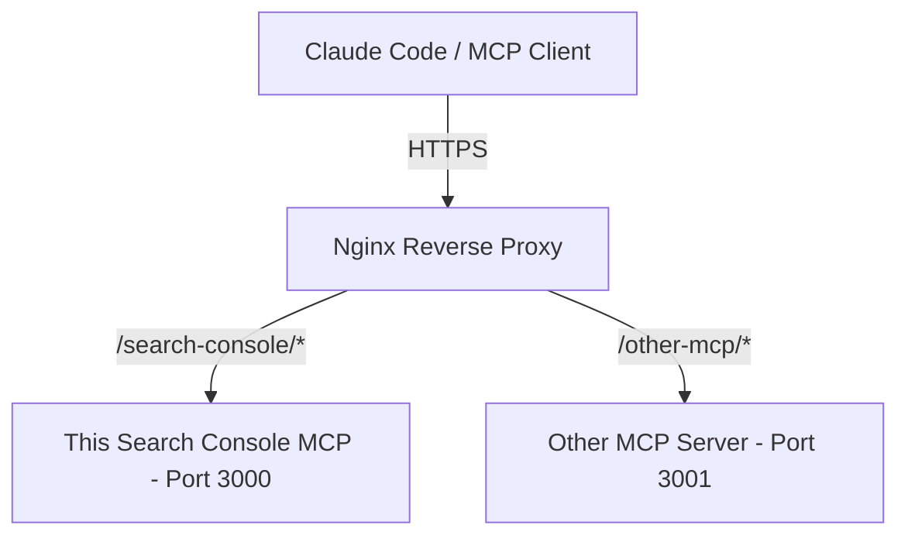

# Search Console MCP Server Conventions (AGENTS.md)

This repository contains the **Search Console MCP Server**. While this repository itself is a single Node.js project, it is architected and configured to be co-hosted on a shared VPS (Virtual Private Server) alongside other internal MCP servers.

## 🏛️ Co-Hosting Architecture

1. **Co-existence on a VPS**:
   - Each MCP server hosted on the VPS runs as an independent Node.js service listening on a unique local port (e.g., this server runs on port `3000`).

2. **Unified Nginx Reverse Proxy**:
   - A single Nginx server block handles TLS (SSL) termination and routes traffic to individual MCP servers using **subpath routing** (e.g., `/search-console` vs `/github`).
   - This server supports the `BASE_PATH` environment variable so that it listens and exposes endpoints (like `/sse` and `/messages`) matching its allocated Nginx subpath.
   - **Why BASE_PATH is necessary inside the project (not just rewritten by Nginx):** The SSE Server Transport protocol sends the POST endpoint path (e.g. `/messages`) back to the client. If Nginx rewrites the prefix before it reaches Express, the server will tell the client to POST messages to `/messages` instead of `/search-console/messages`, causing path collisions at the Nginx level. Keeping `BASE_PATH` inside the application ensures the correct routing path is sent back to the client.

---

## 🛠️ Port & Path Allocations (VPS Example)

When hosting other internal MCP servers on the same VPS, ensure you coordinate ports and subpaths to prevent collisions:

| MCP Server Name | Subpath Prefix | Port | Service Location on VPS |
|---|---|---|---|
| Search Console MCP (This Service) | `/search-console` | `3000` | `/var/www/search-console-mcp` |
| GitHub MCP (Example) | `/github` | `3001` | `/var/www/github-mcp` |
| Database MCP (Example) | `/database` | `3002` | `/var/www/database-mcp` |

---

## 📋 Rules for Deploying Additional MCP Servers on the VPS

When deploying new MCP servers alongside this one:
1. **Assign a Unique Port**: Do not conflict with port `3000`.
2. **Support Dynamic Routing**: Ensure the new servers support path prefixes (similar to the `BASE_PATH` implementation in this codebase) to configure their `/sse` and `/messages` endpoints.
3. **Consistent Security**: Use the `Authorization: Bearer <MCP_API_KEY>` pattern to secure other servers.
4. **Nginx Integration**: Add a matching reverse-proxy location block to the shared Nginx configuration.
